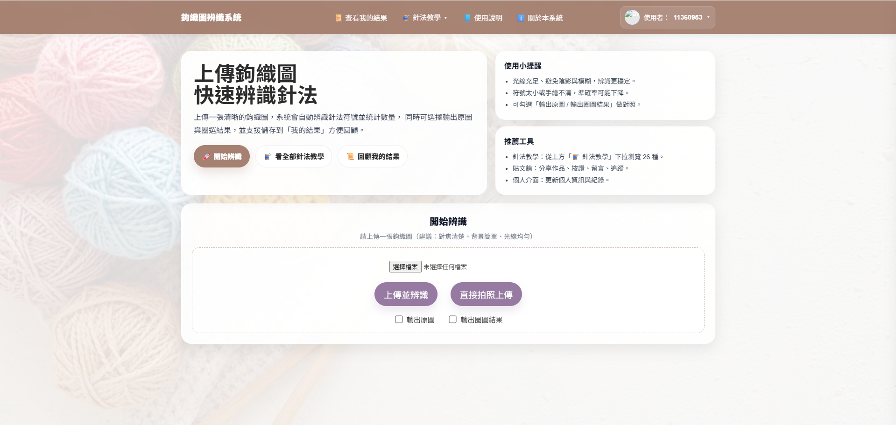
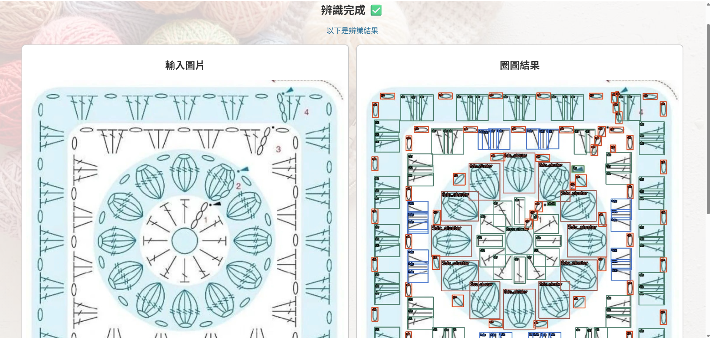
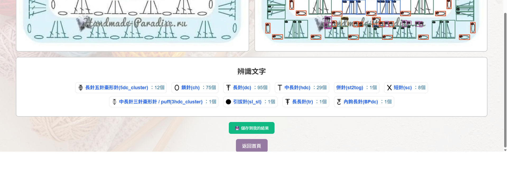

# 🧶 Crochet Pattern Recognition System  
### 鉤織圖案即時辨識系統（Real-time）

---

## 📌 專案簡介（Overview）

本專案為銘傳大學資訊工程學系畢業專題，針對鉤織（Crochet）藝術中複雜且細微的針法圖案，利用 YOLOv8 深度學習演算法進行即時影像辨識。  

本專案整合 YOLOv8 與 Flask 架構，實現一套可即時上傳圖片並進行針法辨識的 Web 系統。系統可自動識別不同鉤織紋路，解決手工藝初學者難以分辨針法與計算針數的問題。

---

## 🛠 技術棧（Tech Stack）

- Programming Language: Python  
- AI Model: YOLOv8 (Ultralytics)  
- Deep Learning: PyTorch  
- Computer Vision: OpenCV  
- Backend: Flask  
- Frontend: HTML / CSS / JavaScript  
- Database: SQLite  
- Tools: LabelImg, Git  

---

## 🚀 技術亮點（Technical Highlights）

- **細粒度圖案辨識**：  
  鉤織圖案具有高重複性與細微差異，專案中針對不同針法特徵進行訓練，使模型能有效區分相似圖案（如 ch、sc、dc）。  

- **資料增強（Data Augmentation）**：  
  透過旋轉、縮放等方式擴充資料集，提升模型在不同角度與光線條件下的辨識穩定性。  

- **資料集建構與標註**：  
  自行蒐集並使用 LabelImg 進行圖像標註，建立專用鉤織資料集，提升模型辨識準確度。  

- **影像辨識結果視覺化**：  
  使用 YOLOv8 將辨識結果以 Bounding Box 與標籤方式呈現，提升辨識結果的可讀性。  

---
## 🧩 系統功能（System Features）

### 🔍 圖片辨識功能（Image Recognition）
- 上傳鉤織圖片進行針法辨識  
- 支援本地圖片上傳  
- 支援相機拍照上傳（行動裝置）  
- 自動辨識針法種類（如 ch、sc、dc）  
- 統計各針法數量  

### 🖼 輸出結果控制（Output Options）
- 可選擇輸出原始圖片  
- 可選擇輸出辨識結果（Bounding Box）  
- 提供辨識結果視覺化呈現  

### ⚙️ 使用者操作功能（User Interaction）
- 圖片選擇與上傳介面  
- 一鍵開始辨識  
- 即時顯示辨識結果  

### 📜 歷史紀錄系統（History System）
- 查看「我的結果」  
- 儲存辨識紀錄  
- 可回顧過往圖片與結果  

### 📚 教學與輔助功能（Learning Support）
- 提供針法教學頁面  
- 說明各種鉤織針法  
- 協助理解辨識結果  

### ℹ️ 系統資訊功能（System Information）
- 使用說明頁面  
- 關於本系統介紹  
- 使用小提醒（光線、清晰度等）  

### 👤 使用者系統（User System）
- 顯示登入使用者資訊  
- 管理個人使用紀錄  

### 🎨 介面設計（UI / UX Features）
- 圖片上傳區（點擊上傳）  
- 操作按鈕（開始辨識 / 拍照上傳）  
- 卡片式介面設計  
- 響應式設計（支援手機）

---
## 📊 成果展示（Demo）

  
  
  

